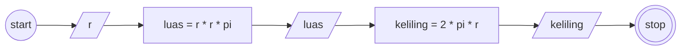

# Menghitung Luas dan Keliling Lingkaran

```mermaid

flowchart LR

a((start))
b[/r/]
c[luas = r * r * pi]
d[/luas/]
e[keliling = 2 * pi * r]
f[/keliling/]
z(((stop)))

a --> b
b --> c
c --> d
d --> e
e --> f
f --> z

```