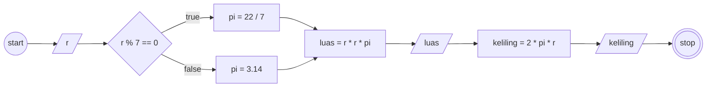

# Program: Menghitung Luas dan Keliling Lingkaran

```mermaid

flowchart LR

a((start))
b[/r/]
c{r % 7 == 0}
d[pi = 22 / 7] 
e[pi = 3.14]
f[luas = r * r * pi]
g[/luas/]
h[keliling = 2 * pi * r]
i[/keliling/]
j(((stop)))

a --> b
b --> c
c --true--> d --> f
c --false--> e --> f
f --> g
g --> h
h --> i
i --> j

```